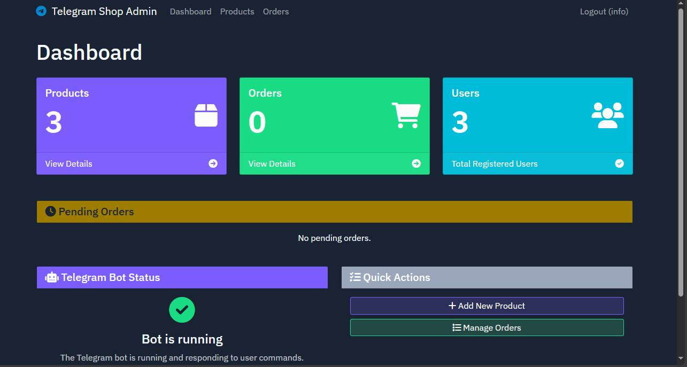

# Telegram Shop

Telegram Shop adalah aplikasi e-commerce berbasis Telegram Bot yang memungkinkan pengguna untuk menjelajahi produk, menambahkan item ke keranjang, dan menyelesaikan pembelian melalui antarmuka Telegram. Aplikasi ini juga mencakup panel admin berbasis web untuk mengelola produk, pesanan, dan pengguna.

## Tampilan Aplikasi



## Fitur

### Bot Telegram
- Jelajahi katalog produk
- Tambahkan produk ke keranjang belanja
- Sesuaikan jumlah dalam keranjang
- Checkout dan pemesanan
- Pelacakan pesanan
- Notifikasi status pesanan

### Aplikasi Web Admin
- Panel admin untuk mengelola produk
- Tambah, edit, dan hapus produk
- Kelola pesanan dan perbarui status
- Lihat detail pesanan
- Sistem autentikasi admin dan pengguna
- Pendaftaran pengguna baru

## Teknologi

- **Backend**: Flask (Python)
- **Bot Telegram**: python-telegram-bot
- **Database**: Sistem penyimpanan berbasis JSON (migrasi ke PostgreSQL direncanakan)
- **Autentikasi**: Flask-Login, Flask-WTF
- **Frontend**: Bootstrap 5 dengan tema dark mode

## Struktur Proyek

```
├── data/                     # Direktori penyimpanan data JSON
├── static/                   # Asset statis
│   ├── css/                  # File CSS
│   └── js/                   # JavaScript
├── templates/                # Template HTML
├── app.py                    # Aplikasi web utama
├── bot.py                    # Kode bot Telegram
├── config.py                 # Konfigurasi aplikasi
├── data.py                   # Fungsi pengolahan data
├── forms.py                  # Definisi formulir
├── main.py                   # Titik masuk aplikasi
├── models.py                 # Model data
└── utils.py                  # Fungsi utilitas
```

## Instalasi dan Pengaturan

1. Clone repositori
2. Instal dependensi:
   ```
   pip install -r requirements.txt
   ```
3. Atur variabel lingkungan:
   - `SESSION_SECRET`: Kunci rahasia untuk sesi
   - `TELEGRAM_TOKEN`: Token API Bot Telegram Anda
   - `ADMIN_USERNAME`: Nama pengguna admin (default: admin)
   - `ADMIN_PASSWORD`: Kata sandi admin (default: password)

4. Jalankan aplikasi:
   ```
   python main.py
   ```

## Penggunaan

### Admin Web
1. Akses panel admin di `http://localhost:5000`
2. Masuk dengan kredensial admin
3. Kelola produk dan pesanan dari dasbor

### Bot Telegram
1. Cari bot Anda di Telegram dengan nama yang Anda daftarkan
2. Mulai obrolan dengan mengirim `/start`
3. Gunakan perintah untuk menjelajahi produk dan membuat pesanan:
   - `/products` - Lihat semua produk
   - `/cart` - Lihat keranjang Anda
   - `/orders` - Lihat pesanan Anda
   - `/help` - Tampilkan bantuan

## Fitur yang Akan Datang

- Integrasi dengan PostgreSQL untuk penyimpanan data
- Sistem pembayaran
- Manajemen inventaris lanjutan
- Analitik penjualan
- Fitur pencarian produk
- Integrasi dengan layanan pengiriman